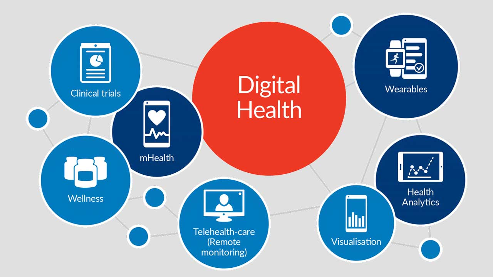
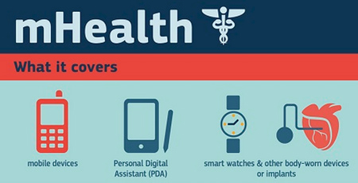
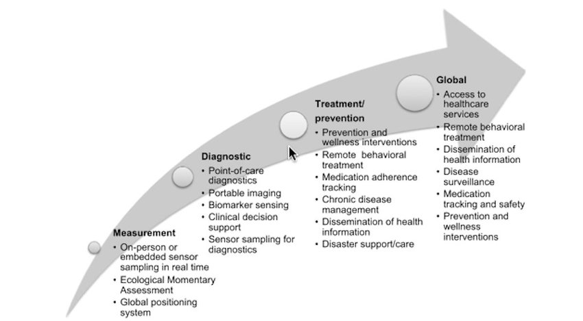
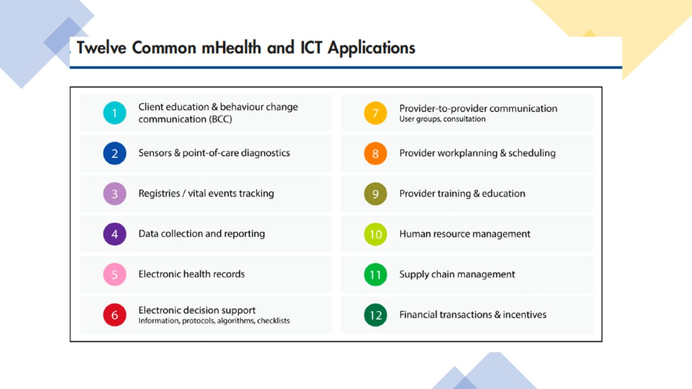
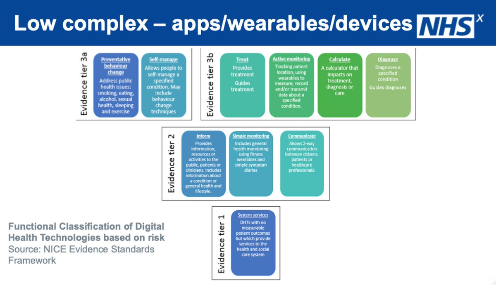

= digital-health-and-ai
:idprefix:
:idseparator: -
:sectanchors:
:sectlinks:
:sectnumlevels: 6
:sectnums:
:toc: macro
:toclevels: 6
:toc-title: Table of Contents

toc::[]

=== Introduction
==== Digital Health
Digital health means leveraging technology to help improve individuals' health and wellness. This technology could be wearable gadgets to ingestible sensors, from mobile health apps to artificial intelligence, from robotic carers to electronic records.

The broad scope of digital health includes categories such as mobile health (mHealth), electronic Health (eHealth), health information technology (IT), wearable devices, telehealth and telemedicine, and personalized medicine.

==== Medical Imaging:
Medical imaging is the technique and process of creating visual representations of the various part of a body for clinical analysis and medical intervention.

Types:
1. Radiography
2. Magnetic resonance imaging
3. Nuclear medicine
4. Ultrasound
5. Elastography
6. Photoacoustic imaging
7. Tomography
8. Echocardiography
9. Functional near-infrared spectroscopy
10. Magnetic Particle Imaging

==== Medical Device
Many medical devices now have the ability to connect to and communicate with other devices or systems. Devices that are already FDA approved, authorized, or cleared are being updated to add digital features. New types of devices that already have these capabilities are being explored.

Many stakeholders are involved in digital health activities, including patients, health care practitioners, researchers, traditional medical device industry firms, and firms new to the FDA regulatory requirements, such as mobile application developers.

The FDA's Center for Devices and Radiological Health is excited about these advances and the convergence of medical devices with connectivity and consumer technology. The following are topics in the digital health field on which the FDA has been working to provide clarity using practical approaches that balance benefits and risks:

* *Artificial Intelligence and Machine Learning (AI/ML) in Software as a Medical Device*
* Cybersecurity
* Device Software Functions, including Mobile Medical Applications
* Health IT
* Medical Device Data Systems
* Medical Device Interoperability
* *Software as a Medical Device (SaMD)*
* Telemedicine
* Wireless Medical Devices

In which we are intersted in *Software as a Medical device*.

==== mHealth
Mobile health (or mhealth) is the practice of medicine and public health supported by mobile devices.

===== mHealth Tools

===== mHealth Applications

==== DHTs classified by function and stratified into evidence tiers

==== To do: List all mobile application seperated by tiers

